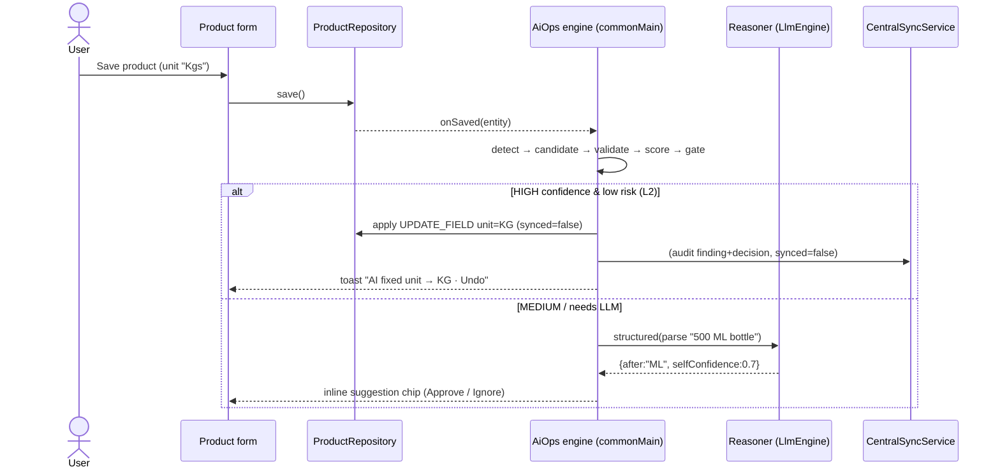
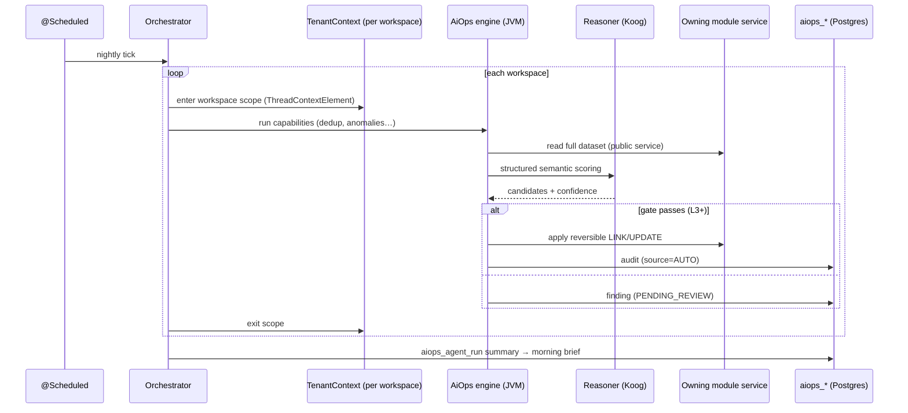

# AI Business Operations Manager — Framework Blueprint

**Status:** Draft blueprint (architecture, not yet a build commitment) · **rev 3** (app-side orchestration)
**Module (app host):** `feature/aiops` (KMP) in `ampairs-app` · **Module (deferred backend host):** `:aiops` — `com.ampairs.aiops`
**Shared engine:** host-agnostic Kotlin SPI (runs on device *and* server) · **Reasoning:** app = on-device/cloud `LlmEngine`; backend (later) = Koog
**Program spine:** [`README.md`](README.md) (roadmap) · **Decisions:** [ADR 0005](../adr/0005-ai-ops-manager-app-side-orchestration.md), [ADR 0006](../adr/0006-aiops-engine-shared-kmp-module.md)
**Related:** `.claude/skills/koog/SKILL.md` · `docs/spikes/koog-agent-backend-spike.md` · `specs/030-koog-agent-assistant` · `specs/031-ai-ops-manager-foundation` · PR #221

> **Read this first.** The product vision maps onto **one reusable decision engine** with pluggable
> capabilities. The settled architectural decision (rev 3, **ADR 0005**) is **where the orchestrator
> runs: app-side.** Each app instance is one workspace with the **full master resident in Room**, the
> `LlmEngine` (on-device + a cloud tier for hard reasoning *calls*, not orchestration hops), and an
> audited write→sync path — so **all** near-term capabilities, *including whole-dataset dedup*, run on
> the app. The **backend** (`:aiops` + Koog) is a **deferred, optional tier** for only always-on
> autonomy and admin cross-tenant. The engine SPI is written **once, host-agnostic** (**ADR 0006**), so
> the same capability can later run under Koog on the server.

---

## 1. The one principle everything serves

> **Automate what is predictable. Escalate what is uncertain. Learn from every human decision. Log and
> reverse everything.**

Every change is gated on **two independent axes** — **confidence** (how sure of the correct value) and
**risk** (how bad if wrong) — and the **LLM is never the sole authority**. Auto-fix happens only when
confidence is high *and* risk low enough for the workspace's autonomy level. Everything else is a human
exception.

---

## 2. Where it runs — app-first, backend-later (the key decision)

### Why app-side first (this is the right start)
The app is not a thin client — it already contains most of what a naive plan would rebuild on the server:

- **The data is already there.** `feature/*` modules hold the workspace's products/customers/units in
  **Room** (offline-first). A detector can scan local rows with zero network.
- **The brain is already there.** `feature/agent` has an on-device `LlmEngine` (LiteRT) **plus** a cloud
  tier (`AmpairsProxyTransport` → backend proxy) for heavier reasoning, an intent/SafeQuery pipeline,
  and an `ActionRegistry` for executing changes.
- **Writes already sync.** A correction is a normal offline-first write (`synced = false` →
  `CentralSyncService` pushes via the entity's `SyncDelegate`). No new write path.
- **The UX is best at the point of edit.** "Implicit action" = when the user saves a product/customer,
  the app quietly checks *that* record and either auto-applies a high-confidence normalization (opt-in)
  or shows an inline suggestion chip — fix-as-you-go, right where attention already is.
- **No new server infra** to ship value: no `:aiops` module, no fleet-scan scheduler, no
  per-workspace-tenant-context-across-threads problem (each app instance is already one workspace/user).

### Dedup runs app-side too (the rev-2→rev-3 correction)
An earlier draft put whole-dataset dedup on the backend for authority. **Revised:** offline-first syncs
the **whole** customer/product master onto each device (ADR 0002), so the app already holds the full set
needed to dedup. Dedup therefore runs **app-side** over the resident master, with two risks recorded
(neither a blocker, per ADR 0005):
- **Non-resident master** (partial sync / very large catalogs) → gate whole-set capabilities on a
  "master fully synced" check; degrade to single-entity capabilities otherwise.
- **Multi-device duplicate work / write conflicts** → absorbed by offline-sync's UID-keyed
  last-write-wins (ADR 0002); prefer reversible **LINK** over destructive **MERGE**.

### What genuinely needs the backend (deferred, optional tier)
- **Always-on / continuous autonomy** (L3–L4) — overnight scans, the morning brief, "I reviewed your
  business while you slept". A phone isn't always on; this is inherently server work.
- **Platform-admin cross-tenant** monitoring across many workspaces.

### Everything near-term is app-side; the split is by *shape* only within the app
```
   APP (near-term)  ►  ALL Epic-1 capabilities, orchestrated on device:
   L0–L2               single-entity: unit standardization · capitalization/format ·
                       GSTIN/phone/pincode↔city↔state validation · hierarchy sanity · contact-card
                       whole-dataset (resident master): product & customer dedup · duplicate SKU/phone
                       ────────────────────────────────────────────────────────────────────────────
   BACKEND (deferred)  ►  only what the device can't do: always-on overnight scans · morning brief ·
   L3–L4, optional        continuous monitoring · admin cross-tenant  — same engine SPI, under Koog
```

### One engine, two hosts
The engine SPI (§3) is **plain Kotlin with no JVM-only or Koog types in the contract**, so it lives in a
**shared KMP module** and each host provides the platform pieces:

| Concern | App host (`feature/aiops`, KMP) | Backend host (`:aiops`, JVM) |
|---|---|---|
| Read business data | feature repos / Room DAOs | other modules' **public services** |
| Reasoning port (`Reasoner`, §8) | on-device `LlmEngine` + cloud tier | **Koog** `AIAgent`/structured output |
| Apply correction | repo write (`synced=false`) + `SyncDelegate` | owning module's public write service |
| Store findings/audit | Room (`aiops_*` tables) → offline-sync | Postgres `aiops_*` tables |
| Trigger | on-save (implicit) + user "clean now" | event stream + `@Scheduled` fleet scan |

> **Boundaries hold on both sides:** the engine never touches another module's DAO/repo directly — app
> host goes through feature repositories, backend host through public services (rule 08). Corrections
> always flow through the owning entity's normal write+sync path, so its validation and `@TenantId`
> rules still apply.

---

## 3. The framework SPI — one pipeline, many plug-ins (host-agnostic)

A "capability" (e.g. *unit standardization*, *customer dedup*) = one set of these plug-ins registered
under a key. The engine wires the flow; only the stages are capability-specific. **No Koog / no `java.*`
in these types** — they compile in `commonMain`.

```kotlin
package com.ampairs.aiops.engine   // shared KMP module

data class Finding(
    val id: String, val capability: String,
    val entityType: String, val entityId: String, val field: String?,
    val summary: String, val signals: Map<String, String>,
)
data class Candidate(
    val field: String?, val before: String?, val after: String?,
    val action: ActionType, val rationale: String, val evidence: List<String>,
)
enum class ActionType { UPDATE_FIELD, MERGE, LINK, DEACTIVATE, CREATE, SPLIT, NO_OP }

// ── Pluggable stages (one set per capability) ──────────────────────────────────
fun interface Detector           { suspend fun detect(scope: Scope): List<Finding> }
fun interface ContextGatherer    { suspend fun gather(f: Finding): FindingContext }
fun interface CandidateGenerator { suspend fun propose(f: Finding, ctx: FindingContext): List<Candidate> }
fun interface CandidateValidator { suspend fun validate(f: Finding, c: Candidate, ctx: FindingContext): Validation }
fun interface ConfidenceScorer   { suspend fun score(f: Finding, c: Candidate, ctx: FindingContext): Confidence }

// ── Ports the HOST implements (platform-specific) ──────────────────────────────
fun interface Reasoner  { suspend fun <T> structured(request: ReasonRequest<T>): T }   // app=LlmEngine, backend=Koog
fun interface Executor  { suspend fun apply(c: Candidate, f: Finding): ExecResult }     // app=repo+sync, backend=service
interface AuditWriter   { suspend fun record(d: Decision) ; suspend fun revert(decisionId: String) }
interface FeedbackStore { suspend fun save(v: HumanVerdict) ; suspend fun examples(capability: String): List<Example> }

data class Confidence(val value: Double, val band: Band, val contributors: Map<String, Double>)
enum class Band { HIGH, MEDIUM, LOW }
```

Fixed engine flow (shared): `Detector → ContextGatherer → CandidateGenerator → CandidateValidator →
ConfidenceScorer → RiskPolicy → (Executor | ReviewQueue) → AuditWriter → FeedbackStore`.

---

## 4. The decision engine — confidence × risk (the heart)

**Confidence is an ensemble; the LLM is one capped signal.** `ConfidenceScorer` weights:
deterministic rules (normalized equality, GSTIN checksum, phone/pincode validators, unit alias tables),
statistical similarity (Jaro-Winkler / token-set, historical frequency), reference data (HSN / pincode /
GSTIN masters), and **LLM reasoning via the `Reasoner` port** (semantic judgment, self-confidence,
rationale). The LLM contribution is capped so it cannot by itself push a high-risk change over the line.

**Risk is a property of the field/action:** reversibility, blast radius (single field vs. merging two
customers with transactions), and **field sensitivity** — tax/HSN/GST and money-adjacent fields are
**high-risk by policy** with a stricter ceiling, and configurable **LLM-advisory-only** (LLM may lower
confidence but never solely authorize). *This encodes the vision's "don't blindly change tax data".*

**Gate:**
```
autoFix ⇔ confidence.value ≥ threshold(capability, level)
          AND risk ≤ ceiling(capability, level)
          AND candidate.reversible
else    ⇒ human exception (REVIEW | ASK)
```

---

## 5. Autonomy levels (per workspace)

Stored via the `setting` module (backend) and mirrored to the app; read by the gate. L0 Observe · L1
Recommend · L2 Auto-correct (low-risk) · L3 Auto-execute (policy) · L4 Autonomous. **Default L1** (propose,
never change). Tax/HSN never auto-applies without an explicit per-workspace opt-in, any level.
App-side (near-term) ships **L0–L2** across all Epic-1 capabilities (single-entity *and* resident-master
dedup); **L3–L4** (continuous/autonomous) are the deferred backend tier.

---

## 6. Data model (`aiops_*`)

Same logical schema both hosts; **app** stores it in Room and syncs it (so audit survives offline and
reaches the server), **backend** in Postgres (authoritative). All rows workspace-scoped
(`OwnableBaseDomain`/`@TenantId` on backend; workspace-DB on app), `Instant` timestamps, backend Flyway
under **both** `postgresql/` + `mysql/`, module added to `migrationModules`.

- **`aiops_finding`** — `id, capability, entity_type, entity_id, field, status(OPEN|AUTO_FIXED|
  PENDING_REVIEW|ACCEPTED|REJECTED|IGNORED), band, summary, signals(json), origin(APP|BACKEND),
  created_at, updated_at`. Index `(owner_id, capability, status)`, `(owner_id, entity_type, entity_id)`.
- **`aiops_decision`** (audit) — `id, finding_id, entity_type, entity_id, field, before, after,
  action, confidence, confidence_contributors(json), risk_level, reason, evidence(json),
  source(AUTO|HUMAN), agent, human_approval(nullable), reversible(bool), reverted_at(nullable),
  created_at`. Index `(owner_id, entity_type, entity_id)`, `(owner_id, created_at)`.
- **`aiops_feedback`** — `id, finding_id, candidate_ref, verdict(APPROVE|REJECT|EDIT|MERGE|KEEP_BOTH|
  IGNORE), edited_value, decided_by, created_at`.
- **`aiops_agent_run`** — `id, trigger(EVENT|SCHEDULE|USER|IMPLICIT), capability, scope, reviewed,
  auto_fixed, needs_review, failed, started_at, finished_at, status`.

`before`/`after` on `aiops_decision` are exactly what make **rollback** first-class (§11). On the app,
`aiops_finding`/`aiops_decision` follow the standard offline-sync contract (own `SyncEntity`), so
server-side gets a consolidated audit even for app-applied fixes.

---

## 7. Execution & triggers (per host)

| Trigger | Host | Flow |
|---|---|---|
| **Implicit (on save)** | App | user saves entity → run that entity's single-entity detectors → auto-fix (L2, opt-in) or inline suggestion chip |
| **User "clean now"** | App | run all local capabilities over the resident workspace data → report + review list |
| **Event-driven** | Backend *(deferred)* | entity create/update on the `event` stream → relevant detectors for that aggregate |
| **Scheduled** | Backend *(deferred)* | nightly per-workspace scan → detect → prioritize → auto-resolve → build morning brief |

The app-side **Implicit (on save)** trigger is the app's own event-driven path — near-term, no backend
needed. The Backend rows are the **deferred tier** (ADR 0005).

**Backend tenant propagation (deferred tier):** fleet scans have no request thread, and Koog switches
coroutine threads, so each per-workspace scan runs inside a `ThreadContextElement` that carries
`TenantContextHolder` across threads (the mechanism the Koog spike validates). Engine-level two-tenant
test mandatory. *(The app host sidesteps this entirely — one instance = one workspace.)*

---

## 8. The reasoning port — `Reasoner` (LLM as advisor, never authority)

The engine calls `Reasoner.structured(...)` for judgment stages only; each host wires its own:
- **App:** the existing `feature/agent` `LlmEngine` — on-device LiteRT for cheap single-entity calls,
  cloud tier (`AmpairsProxyTransport`) for heavier semantic dedup/HSN reasoning. Reuses the app's
  constrained/structured output (`OutputSchema`).
- **Backend:** **Koog** `AIAgent` + structured output + read-only tools over Ampairs services (per the
  Koog skill), for whole-dataset reasoning where the model must consult many records.

Either way the LLM returns a typed `{ candidates[], selfConfidence, rationale, evidenceRefs }` that
enters the ensemble as **one capped contributor**. Capabilities may be flagged advisory-only (mandatory
for tax/HSN).

---

## 9. Agent catalog + placement

| Agent | Capability | Shape | Host (near-term = app) |
|---|---|---|---|
| Product | unit standardization | single-entity | **app** (Epic 1) |
| Product | capitalization/format, single-product hierarchy sanity | single-entity | **app** (Epic 1) |
| Product | dedup, "same product across suppliers", duplicate SKU | whole-dataset (resident master) | **app** (Epic 1) |
| Product | HSN/GST sanity | single-entity, **advisory** | **app** (Epic 1) — suggest only; never auto |
| Customer | field validation (GSTIN/phone/pincode↔city↔state) | single-entity | **app** (Epic 1) |
| Customer | contact card → capture + extract + normalize | single-entity | **app** (Epic 1) |
| Customer | dedup, contact→customer match | whole-dataset (resident master) | **app** (Epic 1) |
| Inventory / Purchase / Sales | low/dead-stock, price/discount/invoice anomalies | cross-entity, temporal | **backend** (Epic 3, deferred) |
| — always-on autonomy · morning brief · admin cross-tenant | orchestration | continuous | **backend** (Epic 2, deferred) |

Near-term, the orchestrator is **app-side** (ADR 0005): on device it runs each capability over the
resident workspace master and aggregates results into the on-device manager view. A **backend**
orchestrator (aggregating `aiops_agent_run` into an overnight morning brief, with global cost/rate
limits) is the deferred Epic-2 tier.

---

## 10. Human-in-the-loop
Exceptions only. App renders inline chips + a decision inbox; backend exposes the queue for the brief.
Actions: `APPROVE | REJECT | EDIT | MERGE | KEEP_BOTH | IGNORE`, `Accept all high-confidence`, and
**Apply-to-similar** (fan a verdict to matching findings). Every verdict writes `aiops_feedback` (→ §12)
and an `aiops_decision`. Backend API under `/aiops/v1` (tenant-scoped, `ApiResponse<T>`, DTOs in
`domain/dto/`).

## 11. Audit & rollback (first-class)
Every action writes `aiops_decision` with before/after + evidence + confidence contributors. **Revert**
re-applies `before` through the same write path (app: repo+sync; backend: `POST /aiops/v1/decisions/{id}
/revert` via the owning service) and stamps `reverted_at`. Prefer reversible **LINK** over destructive
**MERGE**; irreversible actions need higher autonomy + human approval.

## 12. Learning loop
Human verdicts improve future decisions without retraining: **threshold tuning** (track precision /
false-positive per capability, nudge within owner bounds), **few-shot memory** (`FeedbackStore.examples`
feeds the `Reasoner` prompt), **rule promotion** (a pattern humans always approve graduates into a
deterministic rule, leaving the LLM path). Start with the first two.

## 13. Safety guardrails (engine-enforced)
- [ ] Reads via feature repos (app) / public services (backend); writes via the owning entity's normal
      write+sync path — never another module's DAO directly.
- [ ] Confidence is an ensemble; LLM capped; tax/HSN advisory-only.
- [ ] Gate on confidence **and** risk **and** reversibility, per autonomy level; default L1.
- [ ] Dry-run for every capability; idempotent apply; per-workspace cost/rate limits (backend).
- [ ] Full audit + rollback for every mutation; backend scans run in a per-workspace tenant scope.

## 14. Success metrics (vision §19 → concrete)
From `aiops_agent_run` + `aiops_decision` + `aiops_feedback`: **auto-resolution rate**, **human-
intervention rate**, **precision** = approved/(approved+rejected), **false-positive** & **rollback
rate** = reverted/auto_fixed, plus duplicate/invalid/missing-field/standardization trends. **Primary KPI:
% of operations completed correctly without human intervention** = auto_fixed_not_reverted / total.

---

## 15. Concrete walkthrough

### A) Unit standardization — **app-side, implicit** (the Phase-A proof)
Data: product "Basmati Rice" saved with unit `Kgs`.
1. **Trigger (implicit):** `ProductRepository.save` completes → engine runs `product.unit` detectors on
   that one row.
2. **Detect:** `UnitAliasDetector` normalizes `"Kgs"` → not in the canonical set → `Finding(capability=
   "product.unit", entityId=<uid>, field="unit", signals={raw:"Kgs"})`.
3. **Context:** gather the workspace's canonical units (`UnitService`/Room) + the app's alias table.
4. **Candidates:** deterministic alias map → `Candidate(before="Kgs", after="KG", action=UPDATE_FIELD,
   evidence=["alias table: Kgs→KG", "workspace canonical unit KG exists"])`. (No LLM needed here.)
5. **Validate:** `KG` is a real canonical unit in this workspace → pass.
6. **Confidence:** deterministic alias match = 0.999, band HIGH, contributors={rule:1.0}.
7. **Risk:** `unit` = low sensitivity, single field, reversible → low.
8. **Gate @ L2:** HIGH ∧ low-risk ∧ reversible → **auto-fix.** `Executor` writes `unit="KG",
   synced=false` → `CentralSyncService` pushes via `ProductSyncDelegate`.
9. **Audit:** `aiops_decision(before="Kgs", after="KG", confidence=0.999, source=AUTO, reversible=true)`
   → synced to backend. UI shows a subtle "AI fixed unit → KG · Undo".
10. **Learn:** if later a human hits Undo, `aiops_feedback(REJECT)` → the alias's threshold/notes adjust.

*Ambiguous variant:* unit `"L"` on a product named "500 ML bottle" → detector flags quantity/unit
mismatch, `Reasoner` (on-device) parses "500 ML" but self-confidence 0.7 → band MEDIUM → **suggestion
chip**, not auto-fix.

### B) Customer dedup — **app-side, over the resident master**
"ABC Traders" vs "ABC TRADERS PVT LTD", same GSTIN. Offline-first has synced the **whole** customer
master into local Room, so the engine can block over the full resident set on device: `Detector` groups
by GSTIN/phone/name-block across all local customers, `Reasoner`=on-device `LlmEngine` (cloud tier for a
hard fuzzy set) scores the group, and `Executor` performs a reversible **LINK** through the customer
repository + offline-sync — audited locally and synced. Gated on a **"master fully synced"** check; if
the device doesn't hold the full master, the capability degrades to single-entity validation and defers
the cross-record dedup (ADR 0005). No backend required.

---

## 16. Sequence diagrams

**App-side implicit fix (near-term, Epic 1):**


**Backend scheduled scan (deferred Epic-2 tier):**


**Rollback:** human hits Undo → look up `aiops_decision` → apply `before` via the same write path →
stamp `reverted_at` → `aiops_feedback(REJECT)`.

---

## 17. Phasing

Aligned with the roadmap ([`README.md`](README.md)) Epics.

- **Epic 1 — App (ships first, in `ampairs-app`):** shared KMP engine (`feature/aiops`) +
  `Reasoner`/`Executor` app adapters + `aiops_*` Room tables on the offline-sync contract +
  **unit standardization** end-to-end (the §15A proof) + inline suggestion/undo UI. Then
  capitalization/format, customer field validation, contact-card capture+extract, **product & customer
  dedup over the resident master** (§15B), HSN advisory-suggest. Autonomy L0–L2. **No backend module
  needed.**
- **Epic 2 — Backend, deferred/optional (in `ampairs`, `:aiops`):** always-on overnight scans, the
  morning brief, continuous monitoring, and admin cross-tenant — L3–L4. Reuses the *same* engine SPI with
  Koog + public-service adapters; consumes app-synced audit so history is unified. Unpark only on a real
  need for always-on autonomy (entry conditions in the roadmap).
- **Epic 3 — Operations:** inventory / purchase / sales / pricing / supplier anomalies as further
  capabilities; host chosen per shape.

Each capability is *just another plug-in set*; the host decides where it runs.

---

## 18. Open decisions
1. **Module name** — ✅ **`feature/aiops`** (app) / `:aiops` (deferred backend). ADR 0006.
2. **Placement** — ✅ **app-side orchestration; backend deferred/optional.** ADR 0005.
3. **Shared-engine packaging** — does the KMP `aiops-engine` live only in `ampairs-app`, or become a
   **published module** (like data-common/auth) so a future backend consumes the *same* SPI artifact?
   Decide before Epic 2 to avoid two divergent engines. ADR 0006.
4. **Resident-master gate** — the exact "master fully synced" signal for enabling whole-dataset dedup on
   device (per-entity sync checkpoint? count reconciliation?). Epic-1 slice 4.
5. **Merge semantics** — reversible LINK preferred over hard MERGE (strong default).
6. **Reference data** — source/refresh for HSN, pincode↔city↔state, GSTIN format (ship in-app for Epic 1).
7. **Backend async model** — `@Scheduled` + work queue vs Kafka (`event`) vs external scheduler;
   per-workspace concurrency + cost caps. *(Deferred to Epic 2.)*
8. **Vector/RAG store** for few-shot memory + dedup blocking — *(Deferred to Epic 2.)*

---

_Next step: with app-side orchestration + `feature/aiops` locked, the near-term work is the Epic-1
slices in `ampairs-app/docs/design/ai-ops-manager/` (shared engine + unit standardization first). The
backend (`specs/031`) is the deferred Epic-2 tier. See the roadmap [`README.md`](README.md)._
